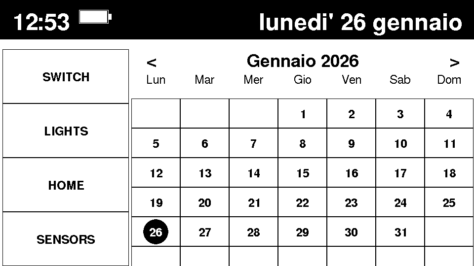

[English](#english) | [Italiano](#italiano)

# M5Paper Smart Home Dashboard

A touchscreen firmware for the **M5Stack M5Paper** that turns the e-ink display into a always-on home panel.  
Data is received primarily via **MQTT** (no Home Assistant token required). Home Assistant REST APIs are used only for lights, switches and scripts control.

<p align="center"></p>

## <a name="english"></a>Features

- **Multi-Page Interface**: Sensors, Home, Lights, Switches, Scripts, Media Player, Analog Clock, Calendar, Appointments/Chat, Log (Chat).
- **MQTT-First**: Sensor values, chat messages, and calendar events are pushed via MQTT — no polling, near-instant updates.
- **No Authentication Token**: Communicates with Home Assistant over a trusted network without a long-lived access token.
- **Web Configuration**: Configure WiFi and MQTT broker via a built-in web interface (no code changes needed).
- **Fallback Hotspot**: If WiFi is unavailable the device starts `M5Paper_Hotspot` for direct configuration access.
- **Dynamic Control**: Toggle lights and switches, adjust brightness, control media players (volume, play/pause/next).
- **Sensor Grid**: First two tiles always show live MQTT values (`potenza_totale`, `sensore_zigbee_temperatura`). Additional HA sensors fill the remaining tiles with pagination.
- **History Graphs**: Tap a sensor tile to view its HA history (6 h / 12 h / 24 h).
- **Analog Clock & Calendar**: Dedicated pages accessible by tapping the time or date in the header.
- **Appointments Page**: Shows today's full date + live messages from MQTT topic `tv/app/calendario`.
- **Chat Log Page**: Live feed of messages from MQTT topic `casa/sensor/pebble_chat`.
- **Dark Mode**: Toggle light/dark display with a tap on the battery icon.
- **Deep Sleep**: Configurable inactivity timeout and sleep duration for battery saving.
- **Remote Screenshot**: Download a BMP screenshot of the current screen via the web interface.

## Required Hardware

- **M5Stack M5Paper**

## MQTT Topics

| Topic | Direction | Description |
|---|---|---|
| `m5paper/update` | subscribe | Triggers a full screen refresh |
| `casa/sensor/potenza_totale` | subscribe | Total power consumption (W) — shown on Sensors page |
| `casa/sensor/sensore_zigbee_temperatura` | subscribe | Room temperature (°C) — shown on Sensors page |
| `casa/sensor/pebble_chat` | subscribe | Chat messages — shown on Log page |
| `tv/app/calendario` | subscribe | Calendar/appointment events — shown on Appointments page |

## Installation and Setup

1. **Flash Firmware**: Open the project in PlatformIO and run `Upload`.
2. **First-Time Setup**:
   - On first boot (or if credentials are invalid) the device shows the configuration page directly.
   - Connect to the **"M5Paper_Hotspot"** WiFi network.
   - Open a browser at `http://192.168.4.1`.
   - Fill in your WiFi credentials and MQTT broker details.
   - Save. The device will reboot and connect to your network.
3. **Later Configuration**:
   - Access the web interface at the device IP address (shown in the header).
   - Available actions: change settings, take a screenshot, factory reset.

## Web Configuration Fields

| Section | Field | Description |
|---|---|---|
| WiFi | Network / Password | Credentials for your home network |
| Home Assistant | Address | Base URL, e.g. `http://192.168.1.100:8123` (used for lights/switches/scripts only) |
| MQTT | Server / Port / User / Password | Broker connection details |
| Power Saving | Deep Sleep / Timeout / Duration | Configurable sleep behaviour |

## User Interface

The screen is split into three areas:

- **Header** (top bar): current time, date, battery icon.
- **Side Menu** (left column): 4 navigation buttons — `SENSORS`, `HOME`, `LIGHTS`, `SWITCH`.
- **Content Area** (right): content of the active page.

### Navigation gestures

| Touch target | Action |
|---|---|
| Side menu button | Switch page |
| Time (top-left) | Open Analog Clock |
| Date (top-right) | Open Appointments page |
| Battery icon | Toggle Dark Mode |

### Pages

| Page | Description |
|---|---|
| **Sensors** | MQTT sensors (always in the first 2 tiles) + HA sensor group with pagination. Tap a tile for its history graph. |
| **Home** | Customisable grid. Default: WiFi hotspot toggle + Log button (opens the Chat Log page). |
| **Lights** | Toggle lights from `light.gruppo_luci`. Long-press opens the brightness control page. |
| **Switches** | Toggle switches from `switch.gruppo_switch`. |
| **Script** | Run HA scripts from a grid. |
| **Media Player** | Volume, play/pause, next/prev for the configured media player. |
| **Analog Clock** | Full-screen analog clock, updated every second. |
| **Calendar** | Monthly calendar view. |
| **Appointments** | Today's date (large) + live MQTT messages from `tv/app/calendario`. |
| **Log (Chat)** | Live feed of messages from `casa/sensor/pebble_chat`, with timestamp. |
| **Graph** | Sensor history chart. Tap the title to cycle the time range (24 h → 6 h → 12 h). |

### Deep Sleep

After the configured inactivity timeout (default: 10 min) the device enters deep sleep. It wakes automatically after the configured duration (default: 10 min) or immediately when the screen is touched.

## Home Assistant Configuration (optional, for control pages)

Only lights, switches and scripts require Home Assistant REST API access. No long-lived token is needed — add the M5Paper IP to the trusted networks in HA:

```yaml
# configuration.yaml
homeassistant:
  auth_providers:
    - type: homeassistant
    - type: trusted_networks
      trusted_networks:
        - 192.168.1.0/24   # adjust to your LAN subnet
      allow_bypass_login: true
```

Groups used by the firmware:

```yaml
group:
  gruppo_luci:
    name: Epaper Lights Group
    entities:
      - light.luce_sala
      - light.luce_cucina

  gruppo_switch:
    name: Epaper Switches Group
    entities:
      - switch.presa_smart

  gruppo_sensori:
    name: Epaper Sensors Group
    entities:
      - sensor.temperatura_esterna
      - sensor.livello_batteria_auto
```

## License

MIT — see the `LICENSE` file for details.

---

English | Italiano

# M5Paper Smart Home Dashboard

Firmware touchscreen per **M5Stack M5Paper** che trasforma il display e-ink in un pannello domotico sempre attivo.  
I dati arrivano principalmente tramite **MQTT** (nessun token Home Assistant richiesto). Le API REST di Home Assistant vengono usate solo per il controllo di luci, switch e script.

<p align="center"></p>

## <a name="italiano"></a>Caratteristiche

- **Interfaccia Multi-Pagina**: Sensori, Home, Luci, Switch, Script, Media Player, Orologio Analogico, Calendario, Appuntamenti/Chat, Log (Chat).
- **MQTT First**: I valori dei sensori, i messaggi di chat e gli eventi del calendario vengono inviati via MQTT — nessun polling, aggiornamenti quasi istantanei.
- **Nessun Token di Autenticazione**: Comunica con Home Assistant sulla rete locale di fiducia, senza token di accesso di lunga durata.
- **Configurazione Web**: Configura WiFi e broker MQTT tramite un'interfaccia web integrata, senza modificare il codice.
- **Hotspot di Fallback**: Se il WiFi non è disponibile, il dispositivo avvia `M5Paper_Hotspot` per la configurazione diretta.
- **Controllo Dinamico**: Attiva/disattiva luci e switch, regola la luminosità, controlla i media player (volume, play/pausa/avanti).
- **Griglia Sensori**: Le prime due celle mostrano sempre i valori MQTT live (`potenza_totale`, `sensore_zigbee_temperatura`). I sensori HA riempiono le celle rimanenti con paginazione.
- **Grafici Storici**: Tocca un sensore per vedere il suo storico da HA (6 h / 12 h / 24 h).
- **Orologio Analogico e Calendario**: Pagine dedicate accessibili toccando ora o data nell'header.
- **Pagina Appuntamenti**: Mostra la data odierna per esteso + messaggi live dal topic MQTT `tv/app/calendario`.
- **Pagina Log / Chat**: Feed live dei messaggi dal topic MQTT `casa/sensor/pebble_chat`.
- **Dark Mode**: Attiva/disattiva la modalità scura toccando l'icona della batteria.
- **Deep Sleep**: Timeout di inattività e durata del sonno configurabili per il risparmio energetico.
- **Screenshot Remoto**: Scarica uno screenshot BMP della schermata attuale tramite l'interfaccia web.

## Hardware Richiesto

- **M5Stack M5Paper**

## Topic MQTT

| Topic | Direzione | Descrizione |
|---|---|---|
| `m5paper/update` | subscribe | Forza un aggiornamento completo dello schermo |
| `casa/sensor/potenza_totale` | subscribe | Consumo elettrico totale (W) — mostrato in pagina Sensori |
| `casa/sensor/sensore_zigbee_temperatura` | subscribe | Temperatura ambiente (°C) — mostrato in pagina Sensori |
| `casa/sensor/pebble_chat` | subscribe | Messaggi di chat — mostrati in pagina Log |
| `tv/app/calendario` | subscribe | Appuntamenti/eventi — mostrati in pagina Appuntamenti |

## Installazione e Configurazione

1. **Flash del Firmware**: Apri il progetto in PlatformIO e lancia `Upload`.
2. **Prima Configurazione**:
   - Al primo avvio (o se le credenziali non sono valide) il dispositivo mostra direttamente la pagina di configurazione.
   - Connettiti all'hotspot WiFi **"M5Paper_Hotspot"**.
   - Apri un browser su `http://192.168.4.1`.
   - Inserisci le credenziali WiFi e i dati del broker MQTT.
   - Salva. Il dispositivo si riavvierà e si connetterà alla rete.
3. **Configurazione Successiva**:
   - Accedi all'interfaccia web all'indirizzo IP del dispositivo (visibile nell'header).
   - Da lì puoi modificare le impostazioni, scattare uno screenshot o resettare il dispositivo.

## Campi di Configurazione Web

| Sezione | Campo | Descrizione |
|---|---|---|
| WiFi | Rete / Password | Credenziali della rete di casa |
| Home Assistant | Indirizzo | URL base, es. `http://192.168.1.100:8123` (usato solo per luci/switch/script) |
| MQTT | Server / Porta / Utente / Password | Dettagli di connessione al broker |
| Risparmio Energetico | Deep Sleep / Timeout / Durata | Configurazione del sonno |

## Interfaccia Utente

Lo schermo è diviso in tre aree:

- **Header** (barra in alto): ora corrente, data, icona batteria.
- **Menu Laterale** (colonna sinistra): 4 pulsanti di navigazione — `SENSORS`, `HOME`, `LIGHTS`, `SWITCH`.
- **Area Contenuti** (destra): contenuto della pagina attiva.

### Gesti di navigazione

| Elemento toccato | Azione |
|---|---|
| Pulsante menu laterale | Cambia pagina |
| Ora (in alto a sinistra) | Apre l'Orologio Analogico |
| Data (in alto a destra) | Apre la pagina Appuntamenti |
| Icona Batteria | Attiva/disattiva Dark Mode |

### Pagine

| Pagina | Descrizione |
|---|---|
| **Sensori** | Sensori MQTT fissi nelle prime 2 celle + gruppo sensori HA con paginazione. Tocca una cella per il grafico storico. |
| **Home** | Griglia personalizzabile. Default: toggle hotspot WiFi + pulsante Log (apre la pagina Chat). |
| **Luci** | Attiva/disattiva le luci di `light.gruppo_luci`. Tocco prolungato per la regolazione della luminosità. |
| **Switch** | Attiva/disattiva gli switch di `switch.gruppo_switch`. |
| **Script** | Esegui script HA da una griglia. |
| **Media Player** | Volume, play/pausa, avanti/indietro per il media player configurato. |
| **Orologio Analogico** | Orologio a schermo intero, aggiornato ogni secondo. |
| **Calendario** | Vista calendario mensile. |
| **Appuntamenti** | Data odierna per esteso (grande) + messaggi live MQTT da `tv/app/calendario`. |
| **Log (Chat)** | Feed live dei messaggi da `casa/sensor/pebble_chat`, con ora di ricezione. |
| **Grafico** | Storico di un sensore. Tocca il titolo per cambiare l'intervallo (24 h → 6 h → 12 h). |

### Deep Sleep

Dopo il timeout di inattività configurato (default: 10 min) il dispositivo entra in deep sleep. Si risveglia automaticamente dopo la durata configurata (default: 10 min) oppure immediatamente al tocco dello schermo.

## Configurazione Home Assistant (facoltativa, solo per le pagine di controllo)

Solo luci, switch e script richiedono l'accesso alle API REST di Home Assistant. Non è necessario nessun token — aggiungi l'IP del dispositivo alle reti fidate in HA:

```yaml
# configuration.yaml
homeassistant:
  auth_providers:
    - type: homeassistant
    - type: trusted_networks
      trusted_networks:
        - 192.168.1.0/24   # adatta alla tua sottorete LAN
      allow_bypass_login: true
```

Gruppi usati dal firmware:

```yaml
group:
  gruppo_luci:
    name: Gruppo Luci Epaper
    entities:
      - light.luce_sala
      - light.luce_cucina

  gruppo_switch:
    name: Gruppo Switch Epaper
    entities:
      - switch.presa_smart

  gruppo_sensori:
    name: Gruppo Sensori Epaper
    entities:
      - sensor.temperatura_esterna
      - sensor.livello_batteria_auto
```

## Licenza

MIT — vedi il file `LICENSE` per i dettagli.
